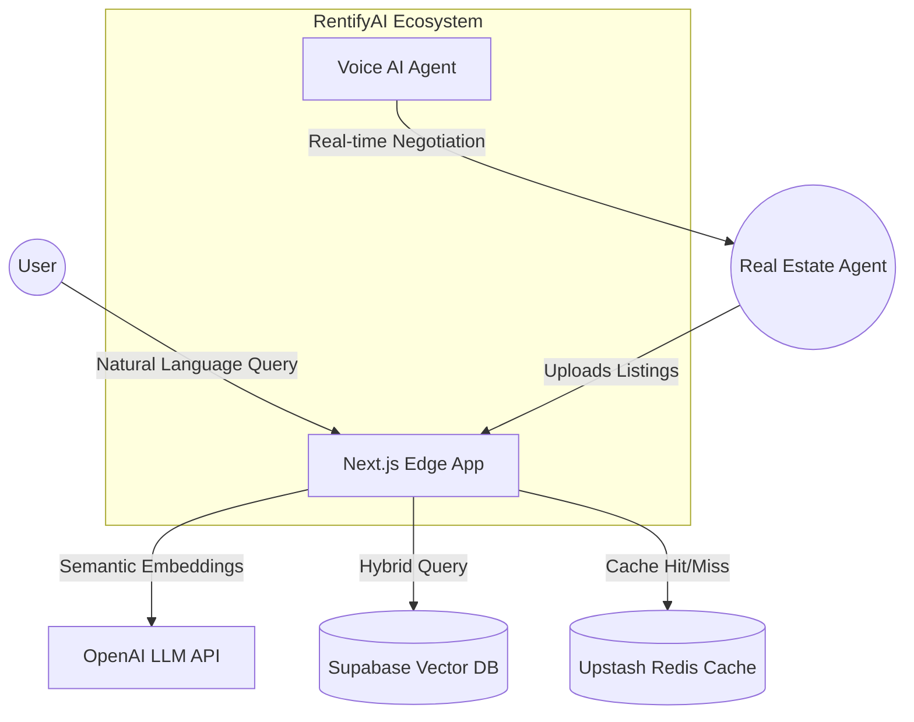

# Architecture Design Record: RentifyAI (Hybrid Search Engine)

> **Role:** Lead Architect & Sole Developer
> **Status:** High-Performance Production Beta
> **Deployment:** Vercel Edge Network (Global)

## 1. Executive Technical Summary
RentifyAI is a **Real-Time Distributed Property Engine** architected to solve the "Semantic Discovery" problem in Real Estate.
Unlike traditional platforms that rely on simple SQL filters (`WHERE price < x`), RentifyAI implements a **Hybrid Search Architecture** combining:
1.  **Geo-Spatial Filtering:** PostGIS (H3 Hexagonal Indexing) for precise location boundaries.
2.  **Vector Semantic Search:** `pgvector` (OpenAI Embeddings) for natural language understanding (e.g., "Quiet flat near a park").
3.  **Edge Caching:** Redis (Upstash) implementation for sub-50ms query resolution.

---

## 2. System Context (C4 Level 1)

---

## 3. Container Architecture (Level 2)
### A. The "Edge" Application Layer (Next.js 14)
*   **Routing:** App Router for server-side streaming of search results.
*   **Compute:** `Edge Functions` used for the Search API to reduce cold starts.
*   **State Management:** Optimistic UI with `Server Actions` for instant booking feedback.

### B. The Data Layer (PostgreSQL + Vectors)
*   **Primary DB:** Supabase (Postgres 16).
*   **Indexing Strategy:**
    *   `GIST` Index for PostGIS (Location).
    *   `IVFFlat` Index for Vector Embeddings (Search speed > accuracy trade-off).
    *   **Reasoning:** Real estate inventory is <1M items; IVFFlat provides sufficient recall (95%) with <10ms latency.

### C. The Concurrency Control (Booking System)
*   **Problem:** Double booking of high-demand units.
*   **Solution:** Implemented **Pessimistic Locking** (`SELECT ... FOR UPDATE`) during the checkout transaction block to ensure ACID compliance.

---

## 4. Key Engineering Trade-offs
### Decision: Hybrid Search vs Pure Vector Search
*   **Option A (Pure Vector):** Good for "Vibe", bad for "Hard filters" (Price/Location).
*   **Option B (Hybrid):** Chosen Approach.
    *   *Implementation:* We first narrow the search space using **PostGIS (SQL)** to the viewport, *then* apply **Vector Similarity (Cosine Distance)** on the remaining subset.
    *   *Benefit:* Reduces vector search cost by 90% and ensures location accuracy.

### Decision: Edge Function vs Serverless Lambda
*   **Choice:** Edge Functions.
*   **Reason:** Our users are global (NRI investors). Edge routing reduces TTFB (Time to First Byte) by ~300ms compared to `us-east-1` Lambdas.

---

## 5. Security & Auth Architecture
*   **Authentication:** Supabase Auth (JWT) with RLS (Row Level Security).
*   **Policy:** `agents` can only `UPDATE` their own rows. `users` can `SELECT` public rows but only `INSERT` into `bookings`.
*   **Defense:** Rate Limiting on the Search API using Redis to prevent LLM-cost denial of service attacks.
